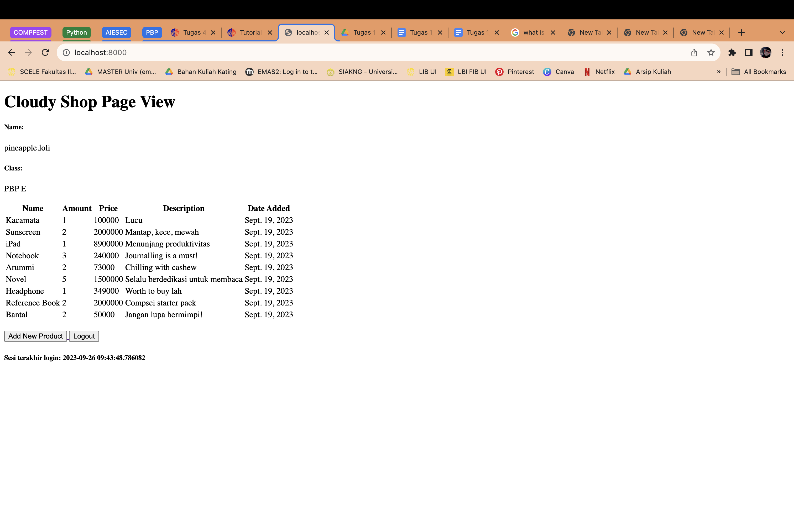
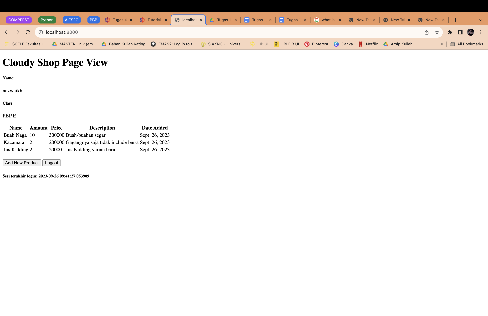

TUGAS 2

Tautan Aplikasi Adaptable: https://tugas2-pbp-nazwa.adaptable.app

...
1. Jelaskan bagaimana cara kamu mengimplementasikan checklist di atas    secara step-by-step (bukan hanya sekadar mengikuti tutorial).
=========
(JAWABAN)
- Membuat direktori baru yang bernama tugas2_pbp. setelah itu melakukan inisiasi direktorinya menjadi repository kosong. Lalu saya menghubungkan repository github dengan repository lokal yang ada di komputer saya.
- Untuk keperluan instalasi django, saya membuat repository baru pada github dengan nama pbp_nazwa. Setelahnya saya menyiapkan properti seperti mengaktifkan environment dan juga menyiapkan dependencies 
- Selanjutnya, saya melakukan konfigurasi pada settings.py untuk deployment di adaptable. 
- Pada repository tugas2_pbp, saya menambahkan file .gitignore dan saya melakukan commit serta push ke repository github, setelahnya saya melakukan deployment pada adaptable. 
- Pada repository tugas2_pbp, saya membuat aplikasi main, selanjutnya agar aplikasi dapat beroperasi, pada menu settings.py, saya mendaftarkan main ke ALLOWED HOST, setelah itu, pada main, saya menambahkan direktori baru 'templates' yang berisi file main.html, gunanya untuk menampilkan hasil eksekusi kode ke peramban. 
- Selanjutnya saya melakukan pembaruan pada file models.py untuk item yang akan dieksekusi dengan atribut nama, jumlah item, dan deskripsinya. untuk mengetahui bahwa terjadi modifikasi pada model, dilakukan migrasi model. 
- Selanjutnya, saya membuat fungsi di views.py dengan komponen nama aplikasi serta identitas diri saya. Setelah membuat fungsi, saya melakukan sedikit modifikasi pada main.html di direktori 'template' pada aplikasi main. Saya menghubungkan context yang ada pada views.py ke main.html
- Langkah finishing, saya melakukan unit testing dan juga routing. Routing ini semacam pemetaan pada direktori tugas2_pbp yang nantinya akan dieksekusi pada aplikasi main dan dicetak pada peramban. 
...

...
2. Buatlah bagan yang berisi request client ke web aplikasi berbasis Django beserta responnya dan jelaskan pada bagan tersebut kaitan antara urls.py, views.py, models.py, dan berkas html
=========
(JAWABAN)

...

...
3. Jelaskan mengapa kita menggunakan virtual environment? Apakah kita tetap dapat membuat aplikasi web berbasis Django tanpa menggunakan virtual environment?
=========
(JAWABAN)
Virtual environment digunakan karena berfungsi untuk mengisolasi package dan depedencies dari aplikasi sehingga tidak bertabrakan dengan versi lain yang ada pada komputer lokal kita. Kita tetap bisa membuat aplikasi web berbasis django tanpa menggunakan virtual environment, namun itu bukan best practice dan juga rentan terjadinya konflik package dan dependenciesnya. 
...

...
4. Jelaskan apakah itu MVC, MVT, MVVM dan perbedaan dari ketiganya.
=========
(JAWABAN)
- MVC adalah Model-View-Controller digunakan untuk mengimplementasikan 
pengaturan data mulai dari tahap menyimpan hingga pembaruan aplikasi.
- MVT adalah Model-View-Template digunakan dengan prinsip yang serupa dengan MVC untuk mengatur data hingga pembaruan aplikasi. 
- MVVM adalah Model-View-ViewModel digunakan dengan prinsip yang serupa dengan MVC dan MVT untuk mengatur data hingga pembaruan aplikasi. 

Perbedaan ketiganya terletak pada bagian Controller, Template, dan ViewModel. 
- Pada MVC, Controller bertugas dalam menerima input dari pengguna, mengirimkan perintah kepada model atau view, dan mengatur alur kontrol aplikasi.
- Pada MVT, Template bertugas untuk mengatur cara tampilan dihasilkan. MVT digunakan untuk menggabungkan data dari model dengan tampilan yang akan ditampilkan kepada pengguna. 
- Sedangkan pada MVVM, ViewModel bertugas sebagai perantara antara Model dan View. Ini mengambil data dari Model dan mengubahnya ke dalam format yang dapat ditampilkan oleh View. ViewModel juga bisa mengelola logika tampilan yang tidak ada dalam Model.

Perbedaan Utama:
- Penggunaan dan Implementasi: MVC adalah pola arsitektur yang paling umum digunakan dalam pengembangan perangkat lunak umum. MVT adalah pola yang digunakan secara khusus dalam kerangka kerja web Django untuk Python. MVVM adalah pola yang umumnya digunakan dalam pengembangan aplikasi berbasis antarmuka pengguna (UI) seperti aplikasi seluler dan desktop.
- Template vs. Controller/ViewModel: Perbedaan utama antara MVT (Django) dan MVC/MVVM adalah penggunaan "Template" di MVT yang mengatur tampilan, sedangkan MVC dan MVVM lebih fokus pada "Controller" atau "ViewModel" untuk mengatur logika tampilan.
- Bahasa dan Platform: MVC dapat digunakan dalam berbagai bahasa pemrograman dan platform. MVT khusus untuk Django (Python). MVVM umumnya digunakan dalam platform tertentu seperti Flutter (Dart) atau Angular (JavaScript/TypeScript).

--------------------------------------------------------------------------
TUGAS 3

1. Apa perbedaan antara form POST dan form GET dalam django?
JAWAB:
Jadi, POST request pada form digunakan untuk mengirimkan data ke web server, sedangkan GET request pada form digunakan untuk mengambil atau membaca data yang ada pada web server. 

2. Apa perbedaan utama antara XML, JSON, dan HTML dalam konteks pengiriman data? 
JAWAB:
XML: bersifat kompleks dan kurang fleksibel, oleh karena itu XML menghasilkan file yang memakan banyak space. Sintak XML mengganti beberapa karakter untuk referensi entitas sehingga membuatnya menjadi lebih bertele-tele. 

JSON: bersifat sederhana dan lebih fleksibel, selain itu juga JSON memiliki ukuran file yang lebih kecil dan transmisi data yang lebih cepat.Sintaks JSON lebih padat dan lebih mudah dibaca serta ditulis. Dalam segi keamanan, JSON memiliki tingkat keamanan yang lebih baik daripada XML. 

HTML: berfokus kepada struktur dan tampilan web server dan bukan pada aspek pertukaran data ke web servernya. HTML seringkali digunakan untuk mengatur tampilan gambar, teks, dan komponen pendukung yang digunakan untuk menciptakan web server interaktif bagi para penggunanya. 

3. Mengapa JSON sering digunakan dalam pertukaran data antara aplikasi web modern?
JAWAB:
Hal ini karena JSON sangat ringan dan mudah dimengerti oleh bahasa manusia sehingga juga lebih mudah untuk diterjemahkan dan di generate oleh komputer. Selain itu, data yang dimuat pada JSON juga mencakup pengaturan tampilan dan kinerja dari web server, sehingga JSON lebih praktis.

4. Jelaskan bagaimana cara kamu mengimplementasikan checklist di atas secara step-by-step (bukan hanya sekadar mengikuti tutorial).
JAWAB: 
-Pada minggu ini, tema yang diperkenalkan adalah bagaimana cara mengirimkan data dari satu stack ke yang lainnya dengan pertukaran data menggunakan JSON dan XML. 
-Langkah pertama saya membuka terminal dan langsung ke direktori proyek yang disimpan dengan nama tugas2_pbp, setelah itu saya melakukan aktivasi environment untuk memulai pengerjaan tugas. 

-Lalu, saya melakukan routing, agar data yang dikirim nantinya tidak tersesat dengam membuka file urls.py yang ada di direktori tugas2_pbp.
-Untuk memastikan tidak terjadi redundansi kode, dbuatlah kerangka pada views. Di root folder, ditambahkan direktori templates yang memuat file base.html, base.html berfungsi sebagai template dasar yang dapat digunakan sebagai kerangka umum untuk halaman web lainnya di dalam proyek.

-Dilakukan perubahan pada file settings.py serta file main.html agar file base.html terdeteksi.
-Setelah melakukan set up, saatnya menambahkan forms.py sebagai wadah yang menampung data yang nantinya akan ditampilkan pada halaman utama. 
-Selanjutnya melakukan perubahan pada views.py, melakukan penambahan import serta melakukan penambahan fungsi untuk menghasilkan formulir yang dapat menambahkan data produk secara otomatis ketika data di-submit dari form.

-Lalu, setelahnya, ditambahkan path baru ke dalam file urls.py supaya terdeteksi. Pada main.html, ditambahkan beberapa modifikasi pada bagian  dengan tujuan ntuk menampilkan data produk dalam bentuk table serta tombol "Add New Product" yang akan redirect ke halaman form.
-Setelah membuat forms.py, saatnya melakukan pengemasan data ke bentuk XML maupun JSON. Untuk melakukan perubahan data menjadi XML, dimulai dengan membuka views.py dan menambahkan fungsi show_xml dan menambahkan import HttpResponse serta Serializer pada bagian paling atas. Serializers digunakan untuk translate objek model menjadi format XML. 
-Setelah itu ditambahkan path baru ke urls.py untuk mengakses fungsi yang sudah diimpor sebelumnya. Hal yang sama juga dilakukan saat melakukan pengemasan data dalam bentuk JSON.

Setelah melakukan rangkaian langkah-langkah dalam menerapkan forms.py, kita dapat melihat data yang telah disimpan pada Postman. Setelah memastikan bahwa server sedang running, kita membuka Postman dan melakukan request GET untuk mendapatkan data yang telah disimpan, selanjutnya kita send request hingga data yang diambil tercetak pada bagian bawah Postman. 

LAMPIRAN SCREENSHOT POSTMAN

- HTML Version

- XML Version

- JSON Version

-XML by ID Version

- JSON by ID Version

--------------------------------------------------------------------------
TUGAS 4

1. Apa itu Django UserCreationForm, dan jelaskan apa kelebihan dan kekurangannya?
JAWAB:
UserCreationForm adalah impor formulir bawaan yang memudahkan pembuatan formulir pendaftaran pengguna dalam aplikasi web. Dengan formulir ini, pengguna baru dapat mendaftar dengan mudah di situs web Anda tanpa harus menulis kode dari awal.
KELEBIHAN:
-Integrasi Django Authentication
UserCreationForm secara otomatis terikat dengan sistem autentikasi dari Django. 
-Validasi Otomatis
UserCreationForm memiliki validasi otomatis untuk memastikan bahwa input yang diberikan oleh pengguna sesuai dengan aturan yang ditetapkan, seperti memeriksa keunikan nama pengguna (username) dan kekuatan kata sandi (password).
-Mudah dikostumisasi
UserCreationForm bisa disesuaikan dengan kebutuhan kita seperti melakukan penambahan atribut tambahan. 

KEKURANGAN:
-Fitur Masih Sederhana
Untuk implementasi pada fitur yang lebih kompleks, UserCreationForm masih memiliki keterbatasan kapabilitas. 
-Masalah Keamanan
Apabila terjadi kesalahan konfigurasi, hal ini dapat berdampak terhadap keamanan. Contohnya seperti serangan XSS, CSRF, dan middleman. 

2. Apa perbedaan antara autentikasi dan otorisasi dalam konteks Django, dan mengapa keduanya penting?
JAWAB:
Autentikasi adalah proses verifikasi untuk mengetahui identitas kita sebagai user yang melakukan log in, sedangkan otorisasi adalah proses yang memverifikasi apakah kita memiliki akses terhadap suatu peramban. Jadi autentikasi untuk mengetahui identitas user seperti username dan password, kalau otorisasi untuk mengetahui apakah kita berhak/memiliki akses terhadap suatu file maupun peramban yang di logged in. 

3. Apa itu cookies dalam konteks aplikasi web, dan bagaimana Django menggunakan cookies untuk mengelola data sesi pengguna?
JAWAB: 
Cookies adalah sekumpulan data yang dikirim dari peramban dan nantinya akan dikirimkan kembali (disimpan) ke komputer pengguna oleh peramban pengguna saat berselancar kembali. Kegunaan cookies dalam mengelola data sesi pengguna:
- Menyimpan informasi log in
Cookies memungkinkan penggunanya untuk dapat mengunjungi website yang sama dikemudian hari tanpa harus kembali menginput username dan password serta identitas lainnya karena sudah tersimpan. 
- Menyimpan pengaturan yang di set up pada website yang telah diakses
Selain menyimpan informasi log in, cookies juga menyimpan riwayat lain seperti pengaturan dari website. Misalnya website yang dibuka berbahasa jepang namun di set up menjadi bahasa inggris, saat kita membuka kembali website nya, akan langsung direkam riwayat pengaturannya sehingga website yang ditampilkan akan tetap berbahasa inggris. 
- Menampilkan iklan
Melalui data sesi pengguna, cookies dapat menampilkan iklan sesuai dengan aktivitas browsingnya. Misalnya pengguna baru saja mengakses website yang menawarkan produk kecantikan, saat pengguna mengakses suatu web yang menampilkan iklan, nantinya iklan tersebut akan berkaitan dengan produk kecantikan berdasarkan riwayat dari aktivitas browsing sebelumnya. 

4. Apakah penggunaan cookies aman secara default dalam pengembangan web, atau apakah ada risiko potensial yang harus diwaspadai?
Cookies sebenarnya aman apabila diimplementasikan dengan tepat. Namun, tetap ada kemungkinan terjadinya risiko potensial dari hacker yang harus diwaspadai diantaranya adalah:
- Mar-In-The-Middle Attack
Hacker bertindak sebagai penyusup diantara pengguna dan web server. Data yang ditransfer diantara keduanya akan diinterupsi dan diambil oleh middle man atau hacker. 
- XSS Attack
Menyisipkan kode umpan yang berbahaya ke suatu website, sehingga pengguna yang mengunjungi website dapat termakan umpan kode tersebut. 
- CSRF Attack
Memengaruhi/menjebak pengguna untuk melakukan tindakan yang tidak seharusnya dilakukan seperti mengklik tombol tertentu. 

5. Jelaskan bagaimana cara kamu mengimplementasikan checklist di atas secara step-by-step (bukan hanya sekadar mengikuti tutorial).
JAWAB:
- Langkah paling pertama adalah mengaktifkan environment pada terminal. Lalu, akan dibuat form registrasi untuk pengguna. Setelah itu, ditambahkan fungsi baru yang namanya register. Fungsi ini ditambahkan pada file views.py yang ada di direktori main.
- Setelah menambahkan fungsi baru register di views.py, selanjutnya adalah mengimport redirect, UserCreationForm, dan juga messages. Lalu, selanjutnya ditambahkan file baru register.html pada subdirektori templates pada direktori main. 
- Setelah menambahkan berkas register.html dan melakukan beberapa penambahan kode di dalamnya, dilakukan impor fungsi register yang sudah dibuat pada urls.py sekaligus menambahkan path baru dari fungsi tersebut. Setelahnya, formulir registrasi akun sudah terbuat. 
- Lalu, saatnya membuat fungsi log in yang nantinya digunakan untuk autentikasi akun dengan membuka file views.py dan membuat fungsi dengan nama login_user dengan parameter request, lalu melakukan import authenticate dan log in yang nantinya berfungsi untuk melakukan autentikasi akun pada website nya.
- Sama seperti langkah sebelumnya, dibuat juga berkas baru pada subdirektori templates yang ada di direktori main dengan nama login.html, setelah menambahkan kode didalamnya, ditambahkan path baru fungsi tersebut pada file urls.py. Hal yang sama juga dilakukan pada saat membuat fungsi log out. Bedanya, pada fungsi log out, kita tidak menambahkan file baru di subdirektori templates, melainkan hanya menambahkan modifikasi minor pada file main.html
- Setelah membuat form registrasi akun, fungsi login dan logout, saatnya membuat restriksi akses, hal ini nantinya akan membuat pengguna yang ingin mengakses web utama harus melakukan login terlebih dahulu. Langkah pertamanya adalah membuka berkas views.py dan menambahkan import login_required. Selanjutnya dilakukan modifikasi pada file views.py dengan menambahkan '@login_required(login_url='/login')' diatas fungsi show_main, hal ini gunanya agar website hanya bisa diakses oleh pengguna yang sudah login (terautentikasi). 
- Selanjutnya, akan ditampilkan riwayat last login dengan pemanfaatan cookies pada website dengan cara membuka kembali file views.py dan menambahkan import HttpResponseRedirect, reverse, dan datetime pada bagian paling atas.
- Setelahnya dilakukan modifikasi minor pada fungsi login_user untuk menambahkan cookie yang bernama last_login untuk melihat kapan terakhir kali pengguna melakukan login. Caranya adalah dengan mengganti kode yang ada pada blok if user is not None. 
- Lalu, pada fungsi show_main, ditambahkan potongan kode 'last_login': request.COOKIES['last_login'] ke dalam variabel context. Setelah itu, dilakukan penambahan pada fungsi logout_user dengan kode 'response.delete_cookie('last_login')' yang berfungsi untuk menghapus cookie last_login saat pengguna melakukan logout.
- Terakhir, untuk menampilkan riwayat last login, dibuka kembali berkas main.html dan ditambahkan potongan kode '<h5>Sesi terakhir login: {{ last_login }}</h5>' . Seperti ketentuan di soal, diminta untuk membuat 2 akun baru untuk mengakses website, akan dilampirkan hasil ss tampilannya dibawah. 
- Langkah paling terakhir adalah menghubungkan Model Product dan User sehingga pengguna yang sedang terotorisasi hanya melihat produk-produk yang telah dibuat sendiri. Pada models.py ditambahkan kode yang mengimport User setelah kode mengimport models. Lalu, pada class Product, ditambahkan atribut baru 'user = models.ForeignKey(User, on_delete=models.CASCADE)' yang berfungsi untuk menghubungkan satu produk dengan satu user melalui sebuah relationship, dimana sebuah produk pasti terasosiasikan dengan seorang user. Selanjutnya, pada file views.py, dilakukan perubahan minor pada fungsi create_product dan juga fungsi show_main. 
- Karena dilakukan penambahan atribut, sehingga perlu dilakukan migrasi supaya perubahan atribut tercatat dan tersimpan. Setelah migrasi sukses, maka proyek sudah bisa di-run sesuai dengan ketentuan checklist yang berlaku. 

LAMPIRAN GAMBAR:
- Tampilan Utama:

- Tampilan Akun baru 1

- Tampilan Akun baru 2

--------------------------------------------------------------------------
TUGAS 5

1. Jelaskan manfaat dari setiap element selector dan kapan waktu yang tepat untuk menggunakannya.
JAWAB: 
- Class Selector: Memilih elemen dengan kelas tertentu. Memungkinkan styling dan manipulasi JavaScript pada elemen yang memiliki kelas tersebut. Digunakan saat ingin memengaruhi beberapa elemen dengan properti yang sama.
- ID Selector: Memilih elemen dengan ID tertentu. Digunakan jika hanya ada satu elemen dengan ID tersebut. Sebaiknya digunakan dengan hati-hati karena ID harus unik dalam satu halaman HTML. Digunakan ketika ingin memengaruhi satu elemen unik pada halaman.
- Attribute Selector : Memilih elemen dengan atribut dan nilai tertentu. Misalnya, [type="text"] akan memilih input dengan type atribut bernilai text. Digunakan saat ingin memilih elemen berdasarkan atribut atau nilainya.

2. Jelaskan HTML5 Tag yang kamu ketahui.
JAWAB:
- <header>: Mengandung informasi pengenalan atau navigasi untuk dokumen atau bagian dokumen.
- <nav>: Mengandung tautan navigasi.
- <section>: Mengandung konten terkait dalam dokumen.
- <article>: Mengandung konten independen yang dapat berdiri sendiri, seperti posting blog atau artikel berita.
- <aside>: Mengandung konten terkait yang berada di samping konten utama, seperti iklan atau daftar tag.
- <footer>: Mengandung informasi penutupan dokumen atau bagian dokumen, seperti informasi kontak atau tautan sosial media.

3. Jelaskan perbedaan antara margin dan padding.
JAWAB: 
Margin digunakan untuk mengatur ruang di luar batas elemen. Tidak memiliki background dan transparan, sehingga elemen di belakangnya bisa terlihat melalui margin. Sedangkan kalau Padding digunakan untuk mengatur ruang di antara batas elemen dan kontennya. Padding memiliki background, jadi tidak transparan. Secara garis besar, margin digunakan untuk menata letak dari sisi luar, sedangkan padding digunakan untuk menata letak dari sisi dalam.

4. Jelaskan perbedaan antara framework CSS Tailwind dan Bootstrap. Kapan sebaiknya kita menggunakan Bootstrap daripada Tailwind, dan sebaliknya?
JAWAB:
Tailwind CSS:
Kelebihan: Fleksibel, konfigurasi sangat rinci, memungkinkan pengembangan desain yang sangat customized.
Minusnya: Membutuhkan penulisan kelas yang lebih banyak, memerlukan pembelajaran sintaks khusus Tailwind.
Digunakan Saat: Membutuhkan desain yang sangat customized dan lebih fleksibel dalam pengembangan UI.

Bootstrap:
Kelebihan: Lebih cepat untuk pengembangan karena banyak komponen UI siap pakai, sintaks lebih sederhana.
Minusnya: Lebih sulit untuk membuat desain yang sangat customzied tanpa menyesuaikan CSS Bootstrap.
Digunakan Saat: Membutuhkan pengembangan cepat dengan antarmuka pengguna yang bersih dan modern, terutama jika tidak memerlukan desain yang sangat unik.

5. Jelaskan bagaimana cara kamu mengimplementasikan checklist di atas secara step-by-step (bukan hanya sekadar mengikuti tutorial).
JAWAB:
-Melakukan penambahan Bootstrap di base.html untuk mengimplementasikan bootstrap pada tampilan web.
-Menambahkan fitur edit dan delete untuk produk, dengan menambah fungsi edit_product dan juga delete_product pada views.py, lalu menambahkan path pada kedua fungsi baru tersebut di urls.py
-Pada main.html, ditambahkan button edit dan juga delete pada setiap produk yang disimpan pada database-nya. 
-Dalam melakukan variasi desain web, digunakan banyak fitur, seperti menambahkan table-striped, lalu mengubah warna font, align nya, serta mengubah tampilan warna pada button. 

--------------------------------------------------------------------------
TUGAS 6

1. Jelaskan perbedaan antara asynchronous programming dengan synchronous programming.
JAWAB:
Asynchronous programming adalah pemrograman dengan mekanisme fungsi lainnya dapat dijalankan meskipun fungsi yang sebelumnya masih dalam proses, sehingga eksekusi fungsi yang ada pada pemrograman tersebut tidak harus sistematis. Dilain sisi, synchronous programming menjalankan fungsi secara sistematis. Dari segi lama waktu eksekusi suatu program, proses asynchronous cenderung lebih cepat dibandingkan dengan proses synchronous. 

2. Dalam penerapan JavaScript dan AJAX, terdapat penerapan paradigma event-driven programming. Jelaskan maksud dari paradigma tersebut dan sebutkan salah satu contoh penerapannya pada tugas ini.
JAWAB:
Paradigma event-driven programming memiliki konsep kerja yang bergantung pada kejadian tertentu. Aliran kontrol (control flow) program ditentukan oleh peristiwa, bukan oleh urutan eksekusi kode. Program yang dirancang dengan paradigma event-driven merespons peristiwa yang terjadi, seperti klik mouse, input pengguna, atau data yang tiba melalui jaringan. Sebagai respons terhadap peristiwa-peristiwa ini, program akan menjalankan fungsi atau tugas-tugas tertentu. Pada tugas ini, penerapan paradigma event-driven programming dapat dilihat pada penggunaan AJAX (Asynchronous JavaScript and XML) untuk memuat data produk secara asinkron (asynchronous). Ketika pengguna mengklik tombol "Add Product by AJAX", sebuah event klik terjadi. Pada saat event ini terjadi, fungsi JavaScript yang menggabungkan AJAX dipanggil.

3. Jelaskan penerapan asynchronous programming pada AJAX.
JAWAB:
Dalam Asynchronous programming yang diimplementasikan pada AJAX, operasi-operasi yang memakan waktu seperti mengambil data dari server dilakukan secara non-blocking. Ini berarti, meskipun aplikasi mengirim permintaan ke server, sehingga aplikasi dapat langsung menjalankan kode lain atau merespons interaksi pengguna tanpa harus menunggu operasi AJAX selesai.

4. Pada PBP kali ini, penerapan AJAX dilakukan dengan menggunakan Fetch API daripada library jQuery. Bandingkanlah kedua teknologi tersebut dan tuliskan pendapat kamu teknologi manakah yang lebih baik untuk digunakan.
JAWAB:
**Fetch API**
- Native JavaScript API: 
Fetch API adalah bagian dari standar JavaScript modern. Ini berarti tidak perlu mengunduh atau menyertakan library tambahan, karena sudah ada secara built-in di dalam browser. Ini mengurangi ukuran dan kompleksitas proyek.

- Promise-Based: 
Fetch API mengembalikan objek Promise, yang memungkinkan penggunaan metode seperti .then() dan .catch() untuk menangani respons dari server. Ini membuatnya lebih mudah untuk mengelola asynchrony dan mengatasi operasi AJAX yang kompleks.

- Fleksibilitas dan Kontrol: 
Fetch API memberi pengembang lebih banyak kendali atas request dan response, seperti mengatur header, metode HTTP, dan mode cors. Fleksibilitas ini memberi ruang untuk menyesuaikan permintaan sesuai dengan kebutuhan proyek.

**jQuery AJAX**:
- Cross-Browser Compatibility: 
Salah satu kelebihan utama jQuery adalah ketika muncul, ia menyederhanakan pengembangan web lintas browser. Namun, saat ini, browser modern telah meningkatkan dukungan untuk fitur-fitur standar seperti Fetch API, yang membuat masalah kompatibilitas lintas browser kurang signifikan.

- Sintaks yang Mudah: 
Salah satu alasan pengembang memilih jQuery adalah sintaks yang lebih mudah digunakan dan dipahami, terutama bagi mereka yang baru memasuki dunia pengembangan web. Ini memungkinkan pemula mengambil alih pengembangan web dengan cepat.

- Plugin Ekosistem: 
jQuery memiliki ekosistem plugin yang luas yang mencakup berbagai fitur siap pakai, dari animasi hingga validasi formulir. Jika proyek Anda membutuhkan banyak plugin tambahan, jQuery bisa memberi manfaat karena ada kemungkinan sudah ada plugin yang memenuhi kebutuhan tersebut.

Menurut saya penggunaan teknologi Fetch API, hal ini karena implementasi AJAX masih sederhana dan belum memerlukan properti yang kompleks. Selain itu, dalam pengembangan modern, sudah banyak proyek yang memanfaatkan modul JavaScript, manajemen status, dan kerangka kerja frontend seperti React, Angular, atau Vue.js, banyak pengembang memilih untuk mengandalkan Fetch API dan pendekatan JavaScript modern karena kebersamaan yang lebih baik dengan teknologi-teknologi tersebut.