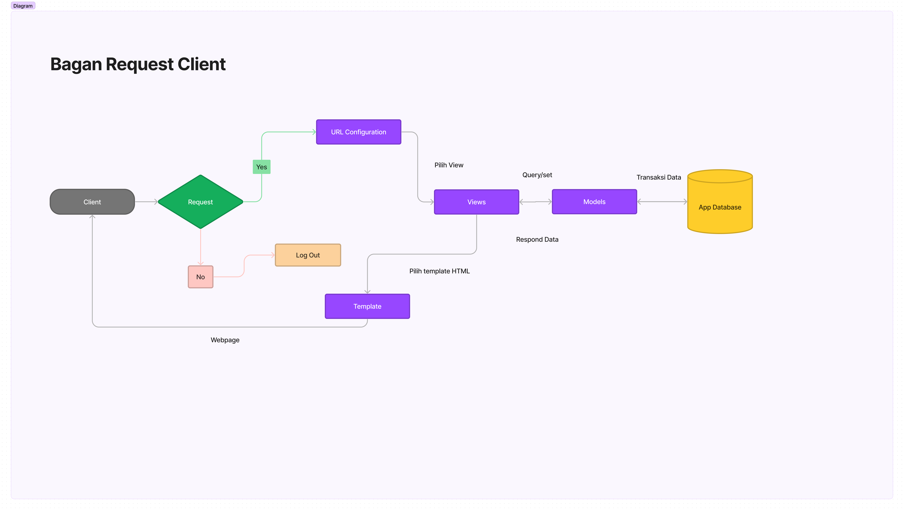
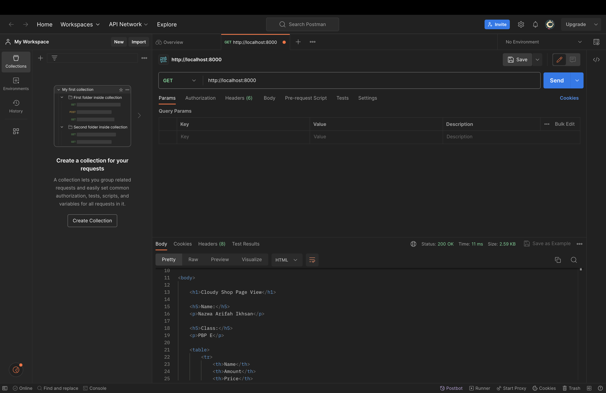
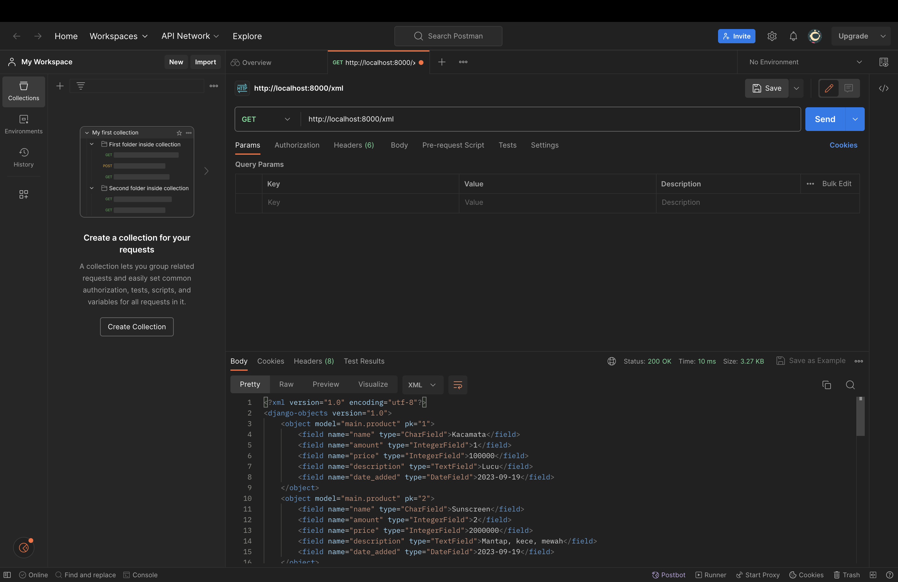
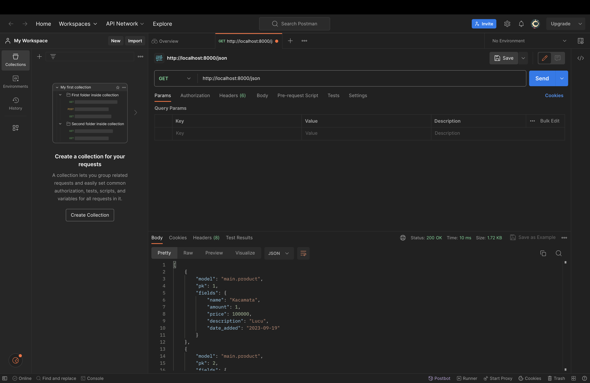

TUGAS 2

Tautan Aplikasi Adaptable: https://tugas2-pbp-nazwa.adaptable.app

...
1. Jelaskan bagaimana cara kamu mengimplementasikan checklist di atas    secara step-by-step (bukan hanya sekadar mengikuti tutorial).
=========
(JAWABAN)
- Membuat direktori baru yang bernama tugas2_pbp. setelah itu melakukan inisiasi direktorinya menjadi repository kosong. Lalu saya menghubungkan repository github dengan repository lokal yang ada di komputer saya.
- Untuk keperluan instalasi django, saya membuat repository baru pada github dengan nama pbp_nazwa. Setelahnya saya menyiapkan properti seperti mengaktifkan environment dan juga menyiapkan dependencies 
- Selanjutnya, saya melakukan konfigurasi pada settings.py untuk deployment di adaptable. 
- Pada repository tugas2_pbp, saya menambahkan file .gitignore dan saya melakukan commit serta push ke repository github, setelahnya saya melakukan deployment pada adaptable. 
- Pada repository tugas2_pbp, saya membuat aplikasi main, selanjutnya agar aplikasi dapat beroperasi, pada menu settings.py, saya mendaftarkan main ke ALLOWED HOST, setelah itu, pada main, saya menambahkan direktori baru 'templates' yang berisi file main.html, gunanya untuk menampilkan hasil eksekusi kode ke peramban. 
- Selanjutnya saya melakukan pembaruan pada file models.py untuk item yang akan dieksekusi dengan atribut nama, jumlah item, dan deskripsinya. untuk mengetahui bahwa terjadi modifikasi pada model, dilakukan migrasi model. 
- Selanjutnya, saya membuat fungsi di views.py dengan komponen nama aplikasi serta identitas diri saya. Setelah membuat fungsi, saya melakukan sedikit modifikasi pada main.html di direktori 'template' pada aplikasi main. Saya menghubungkan context yang ada pada views.py ke main.html
- Langkah finishing, saya melakukan unit testing dan juga routing. Routing ini semacam pemetaan pada direktori tugas2_pbp yang nantinya akan dieksekusi pada aplikasi main dan dicetak pada peramban. 
...

...
2. Buatlah bagan yang berisi request client ke web aplikasi berbasis Django beserta responnya dan jelaskan pada bagan tersebut kaitan antara urls.py, views.py, models.py, dan berkas html
=========
(JAWABAN)

...

...
3. Jelaskan mengapa kita menggunakan virtual environment? Apakah kita tetap dapat membuat aplikasi web berbasis Django tanpa menggunakan virtual environment?
=========
(JAWABAN)
Virtual environment digunakan karena berfungsi untuk mengisolasi package dan depedencies dari aplikasi sehingga tidak bertabrakan dengan versi lain yang ada pada komputer lokal kita. Kita tetap bisa membuat aplikasi web berbasis django tanpa menggunakan virtual environment, namun itu bukan best practice dan juga rentan terjadinya konflik package dan dependenciesnya. 
...

...
4. Jelaskan apakah itu MVC, MVT, MVVM dan perbedaan dari ketiganya.
=========
(JAWABAN)
- MVC adalah Model-View-Controller digunakan untuk mengimplementasikan 
pengaturan data mulai dari tahap menyimpan hingga pembaruan aplikasi.
- MVT adalah Model-View-Template digunakan dengan prinsip yang serupa dengan MVC untuk mengatur data hingga pembaruan aplikasi. 
- MVVM adalah Model-View-ViewModel digunakan dengan prinsip yang serupa dengan MVC dan MVT untuk mengatur data hingga pembaruan aplikasi. 

Perbedaan ketiganya terletak pada bagian Controller, Template, dan ViewModel. 
- Pada MVC, Controller bertugas dalam menerima input dari pengguna, mengirimkan perintah kepada model atau view, dan mengatur alur kontrol aplikasi.
- Pada MVT, Template bertugas untuk mengatur cara tampilan dihasilkan. MVT digunakan untuk menggabungkan data dari model dengan tampilan yang akan ditampilkan kepada pengguna. 
- Sedangkan pada MVVM, ViewModel bertugas sebagai perantara antara Model dan View. Ini mengambil data dari Model dan mengubahnya ke dalam format yang dapat ditampilkan oleh View. ViewModel juga bisa mengelola logika tampilan yang tidak ada dalam Model.

Perbedaan Utama:
- Penggunaan dan Implementasi: MVC adalah pola arsitektur yang paling umum digunakan dalam pengembangan perangkat lunak umum. MVT adalah pola yang digunakan secara khusus dalam kerangka kerja web Django untuk Python. MVVM adalah pola yang umumnya digunakan dalam pengembangan aplikasi berbasis antarmuka pengguna (UI) seperti aplikasi seluler dan desktop.
- Template vs. Controller/ViewModel: Perbedaan utama antara MVT (Django) dan MVC/MVVM adalah penggunaan "Template" di MVT yang mengatur tampilan, sedangkan MVC dan MVVM lebih fokus pada "Controller" atau "ViewModel" untuk mengatur logika tampilan.
- Bahasa dan Platform: MVC dapat digunakan dalam berbagai bahasa pemrograman dan platform. MVT khusus untuk Django (Python). MVVM umumnya digunakan dalam platform tertentu seperti Flutter (Dart) atau Angular (JavaScript/TypeScript).

--------------------------------------------------------------------------
TUGAS 3

1. Apa perbedaan antara form POST dan form GET dalam django?
JAWAB:
Jadi, POST request pada form digunakan untuk mengirimkan data ke web server, sedangkan GET request pada form digunakan untuk mengambil atau membaca data yang ada pada web server. 

2. Apa perbedaan utama antara XML, JSON, dan HTML dalam konteks pengiriman data? 
JAWAB:
XML: bersifat kompleks dan kurang fleksibel, oleh karena itu XML menghasilkan file yang memakan banyak space. Sintak XML mengganti beberapa karakter untuk referensi entitas sehingga membuatnya menjadi lebih bertele-tele. 

JSON: bersifat sederhana dan lebih fleksibel, selain itu juga JSON memiliki ukuran file yang lebih kecil dan transmisi data yang lebih cepat.Sintaks JSON lebih padat dan lebih mudah dibaca serta ditulis. Dalam segi keamanan, JSON memiliki tingkat keamanan yang lebih baik daripada XML. 

HTML: berfokus kepada struktur dan tampilan web server dan bukan pada aspek pertukaran data ke web servernya. HTML seringkali digunakan untuk mengatur tampilan gambar, teks, dan komponen pendukung yang digunakan untuk menciptakan web server interaktif bagi para penggunanya. 

3. Mengapa JSON sering digunakan dalam pertukaran data antara aplikasi web modern?
JAWAB:
Hal ini karena JSON sangat ringan dan mudah dimengerti oleh bahasa manusia sehingga juga lebih mudah untuk diterjemahkan dan di generate oleh komputer. Selain itu, data yang dimuat pada JSON juga mencakup pengaturan tampilan dan kinerja dari web server, sehingga JSON lebih praktis.

4. Jelaskan bagaimana cara kamu mengimplementasikan checklist di atas secara step-by-step (bukan hanya sekadar mengikuti tutorial).
JAWAB: 
-Pada minggu ini, tema yang diperkenalkan adalah bagaimana cara mengirimkan data dari satu stack ke yang lainnya dengan pertukaran data menggunakan JSON dan XML. 
-Langkah pertama saya membuka terminal dan langsung ke direktori proyek yang disimpan dengan nama tugas2_pbp, setelah itu saya melakukan aktivasi environment untuk memulai pengerjaan tugas. 

-Lalu, saya melakukan routing, agar data yang dikirim nantinya tidak tersesat dengam membuka file urls.py yang ada di direktori tugas2_pbp.
-Untuk memastikan tidak terjadi redundansi kode, dbuatlah kerangka pada views. Di root folder, ditambahkan direktori templates yang memuat file base.html, base.html berfungsi sebagai template dasar yang dapat digunakan sebagai kerangka umum untuk halaman web lainnya di dalam proyek.

-Dilakukan perubahan pada file settings.py serta file main.html agar file base.html terdeteksi.
-Setelah melakukan set up, saatnya menambahkan forms.py sebagai wadah yang menampung data yang nantinya akan ditampilkan pada halaman utama. 
-Selanjutnya melakukan perubahan pada views.py, melakukan penambahan import serta melakukan penambahan fungsi untuk menghasilkan formulir yang dapat menambahkan data produk secara otomatis ketika data di-submit dari form.

-Lalu, setelahnya, ditambahkan path baru ke dalam file urls.py supaya terdeteksi. Pada main.html, ditambahkan beberapa modifikasi pada bagian  dengan tujuan ntuk menampilkan data produk dalam bentuk table serta tombol "Add New Product" yang akan redirect ke halaman form.
-Setelah membuat forms.py, saatnya melakukan pengemasan data ke bentuk XML maupun JSON. Untuk melakukan perubahan data menjadi XML, dimulai dengan membuka views.py dan menambahkan fungsi show_xml dan menambahkan import HttpResponse serta Serializer pada bagian paling atas. Serializers digunakan untuk translate objek model menjadi format XML. 
-Setelah itu ditambahkan path baru ke urls.py untuk mengakses fungsi yang sudah diimpor sebelumnya. Hal yang sama juga dilakukan saat melakukan pengemasan data dalam bentuk JSON.

Setelah melakukan rangkaian langkah-langkah dalam menerapkan forms.py, kita dapat melihat data yang telah disimpan pada Postman. Setelah memastikan bahwa server sedang running, kita membuka Postman dan melakukan request GET untuk mendapatkan data yang telah disimpan, selanjutnya kita send request hingga data yang diambil tercetak pada bagian bawah Postman. 

LAMPIRAN SCREENSHOT POSTMAN

- HTML Version

- XML Version

- JSON Version

-XML by ID Version

- JSON by ID Version
